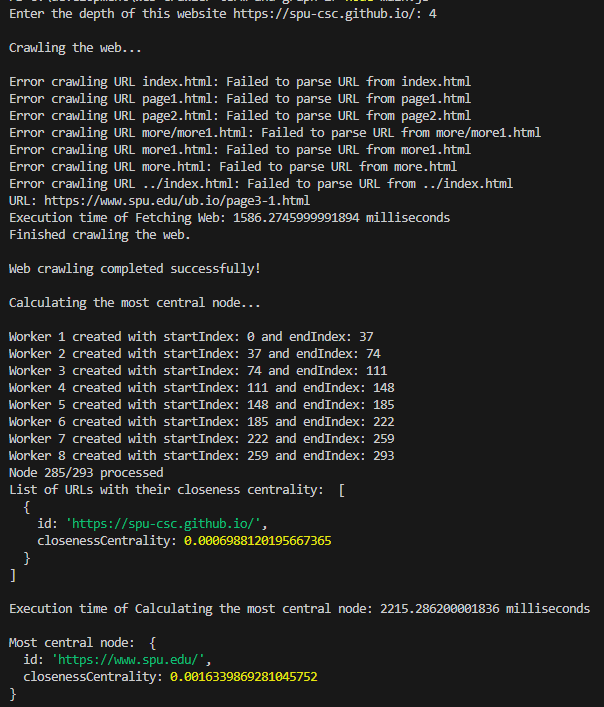
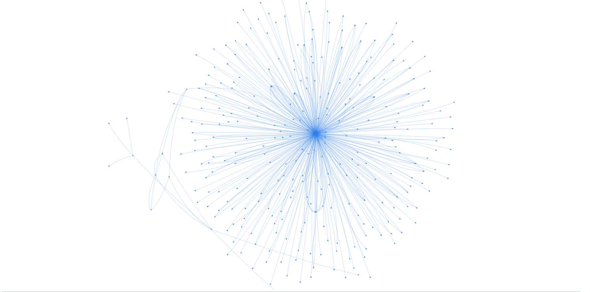

# Web Crawler

A web crawler application that creates a web-link graphs and finds the Closeness Centrality for each node

Read the PowerPoint.
_You may use the Graph Library Shortest Paths functions_
_You **may not** use the Graph Library Closeness Centrality functions_

**DO NOT COPY, DO THE PROJECT 100% YOURSEVES**

## Introduction

This "Web Crawler" is a program created to delve into the intricate network graphs inherent in websites. Its primary function is to traverse through the digital landscape of any given website, mapping out the interconnectedness of its web pages. Additionally, the crawler employs Dijkstra algorithms to compute the closeness between visited websites, enabling the identification of the most central website within the network.

## Description

The program begins by accepting a list of URLs as input. Upon input, the user specifies the desired depth of crawling for each website. Subsequently, the program initiates the crawling process, navigating through the provided URLs to discover the linked web pages within the specified depth. Throughout the crawling process, the program actively reports any inaccessible web pages encountered. After the crawling phase is completed, the program can creates a network graph by using Live Server to visually depict the connectivity between web pages. Following this, the program proceeds to compute the closeness centrality for each visited website. Finally, the program outputs a sorted list of visited websites, with the most central website prominently displayed at the top.

## Requirements

- Visual Studio Code as a coding environment.

- Live Server (by Ritwick Dey) as an extension in Visual Studio Code.

- Preferable 8-cores CPU.

## User Manual

- Create a "development" folder in disk C of your computer.

- Clone the program through "https://github.com/csc3430-winter2024/web-crawler-term-and-graph-2.git" with the local path: "C:\development\web-crawler-term-and-graph-2".

- Change the desired websites to be crawled in "urls.txt" inside Visual Studio Code.

- Open terminal in your computer and navigate to this directory: "C:\development\web-crawler-term-and-graph-2".

- Then do "npm install" and "node main.js".

- Follow the instructions shown on the console to start the crawling process.

- To display the connectivity graph, right click on the "display_graph.html" and choose "Open with Live Server" in Visual Studio Code.

## Reflection

The process of crawling a website and calculating the most central node involves several key operations, each with its own time complexity:

- Getting depths from the user: Similarly, obtaining the desired depth for crawling from the user also has a time complexity of O(n), where n corresponds to the number of URLs provided.

- Crawling the website: This operation has a time complexity of O(V _ E), where V denotes the number of unique URLs visited during crawling, and E represents the total number of edges in the resulting network graph. Traversing each URL once is necessary, and in the worst-case scenario, each URL may link to all other unique URLs, resulting in V _ E operations.

- Calculating the most central node: The time complexity for this task is O(V^2), where V signifies the number of unique URLs. This complexity arises from the creation of a square matrix with dimensions V × V and subsequent calculations based on it.

Overall, the total time complexity for the entire process can be summarized as O(n) + O(V \* E) + O(V^2).

During the graphing process, we employed Vis.js as our graphing tool. However, we encountered challenges with graph display due to the abundance of nodes and edges, resulting in an unstable and cluttered visualization. To address this issue, we implemented additional option parameters to fine-tune the graph, ensuring stability and evenly spreading out the edges. This adjustment greatly enhanced the clarity and comprehensibility of the visualization, facilitating a more intuitive understanding of the network structure.

During the programming process, we encountered two significant challenges. First and foremost, crawling https://spu.edu with a depth of 2 or more produced over 4000 nodes and 200,000 edges. This web crawling procedure would take over 1 hour. However, taking advantage of the asynchronous nature of JavaScript, we were able to process 10 fetches concurrently to reduce downtime among I/O operations. Now, we can traverse the depth 3 of https://spu.edu with 10,000+ nodes in a span of 11 minutes. Secondly, we faced the challenge of calculating the closeness centrality quickly. Given that JavaScript is a single-threaded language, any CPU-intensive operation is outperformed by other high-level languages. However, to counteract this issue, we employed the use of worker_thread to create virtual threads and optimize performance by leveraging parallelism - calculating the closeness centrality for 3000 nodes in a span of 1 hour and 20 minutes.

[Here is the Web Crawling Youtube Video!](https://www.youtube.com/watch?v=MY4cxp9jnFc)

## Results

#### Test case 1:

> https://spu-csc.github.io/
> Depth 4

This is the output of the program.

This is the connectivity graph using Live Server.

